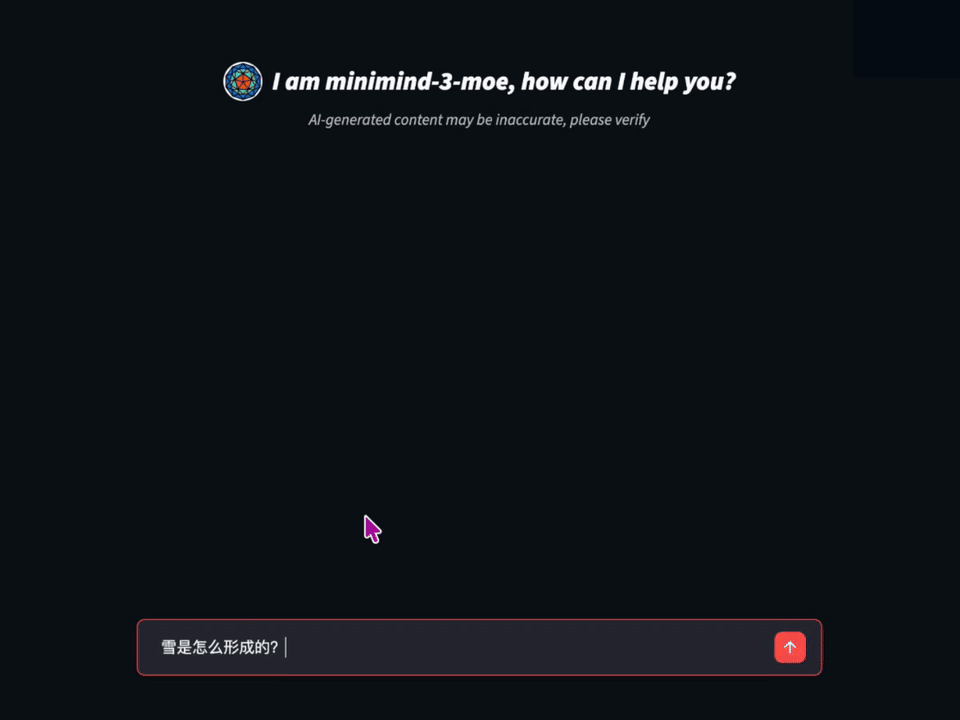

<div align="center">


</div>

<div align="center">


[](https://github.com/1057237562/Instinct/stargazers)
[](LICENSE)
[](https://github.com/1057237562/Instinct/commits/master)
[](https://github.com/1057237562/Instinct/pulls)
[](https://huggingface.co/collections/1057237562/Instinct-66caf8d999f5c7fa64f399e5)

</div>

<div align="center">


</div>

<div align="center">
  <h3>"The Great Way is Simple"</h3>
</div>

<div align="center">

[中文](./README.md) | English

</div>

<div align="center">



</div>

Train small language models from scratch: one pure-PyTorch codebase covering
Dense, MoE, and the Instinct V2 latent recurrent-depth architectures. The
current repository configuration has completed pretraining, SFT, resume-from-
checkpoint training, and inference validation on a single RTX 5070 Ti 16GB
under Windows 11.

All core algorithms (Pretrain / SFT / LoRA / DPO / PPO / GRPO / CISPO / Agentic RL / distillation) are implemented natively in PyTorch — no `trl` / `peft` style high-level wrappers — so every line is readable, editable, and reproducible.

---

## Features

- **Single-GPU training**: the V1 MoE 16GB + Muon configuration totals 678.7M parameters with 106.2M active per token (hidden 512, 32 layers)
- **Pure native implementation**: no third-party training framework abstractions — Transformer, LoRA and the RL family are hand-written
- **Complete training pipeline**: Pretrain → CPT → SFT → LoRA → DPO → PPO / GRPO / CISPO → Agentic RL → Distillation
- **Multiple architectures**: Dense, MoE, and Instinct V2 recurrent depth; V1 MoE uses 8 experts with top-1 routing
- **Instinct V2 recurrent depth**: Prelude / latent recurrent core / Coda — extend latent-space inference compute at test time with `num_steps`
- **Inference fast path**: static KV cache + decode-step CUDA graph + fused RMSNorm/SwiGLU kernels; the MoE grouped GEMM auto-selects a native / triton / cached backend per platform
- **Adaptive sequence buckets**: experimental length-bucketed packing driven by a wall-time DP, memory-aware batching, deterministic shuffling, and a persistent compile cache
- **Dual corpus formats**: train directly from JSONL or Parquet, with a Rust compiler (~3x size reduction) whose streaming chunks stay aligned across formats
- **Mandatory data identity hygiene**: a full triage → audit → clean/repair → identity-anchor → review-handoff toolchain; every training corpus must pass the identity check before use
- **Modern runtime compatibility**: adapted to Transformers 5 / huggingface-hub 1, with round-trip saving of configs, tokenizer, and safetensors
- **Low-memory data pipeline**: SFT data normalization, streaming replay sampling, disk-backed chunk shuffling, an LRU dataset-cache budget, and WebUI dataset auto-discovery
- **Ecosystem compatibility**: weights convert to HuggingFace format; works with `llama.cpp` / `vllm` / `ollama` / `sglang`
- **Chinese-friendly**: bundled 6400-vocab BPE tokenizer with tool-call (`<tool_call>`) and thinking (`<think>`) tag support

---

## Getting Started

### Environment

```bash
pip install -r requirements.txt
```

`requirements.txt` does not pin a PyTorch build — install a CUDA build that
matches your driver separately. CPU smoke tests work without a GPU, but full
training wants an NVIDIA GPU.

#### Verified environment

The following is the local environment this repo is actually validated on
(2026-09-06), not a minimum requirement:

| Item | Current configuration |
|------|----------|
| OS | Windows 11 Home Chinese 64-bit (build 26200) |
| CPU | AMD Ryzen 9 9950X, 16 cores / 32 threads |
| Memory | 48GB (about 47.2GiB usable) |
| GPU | NVIDIA GeForce RTX 5070 Ti, 16GB (16303MiB) |
| NVIDIA driver | 616.56 (driver-reported CUDA 13.4) |
| Python | 3.12.8 |
| PyTorch | 2.13.0+cu132 (CUDA runtime 13.2) |
| cuDNN | 9.2.0 |
| Transformers | 5.16.1 |

The GPU is Blackwell (compute capability 12.0). `torch.compile` on Windows
requires UTF-8 mode; the Config WebUI sets `PYTHONUTF8=1` automatically when
launching training. The MoE grouped-GEMM `auto` backend depends on Triton on
Windows (`requirements.txt` ships `triton-windows`; Linux gets Triton with
PyTorch). Without it the backend falls back to the host-synchronizing
`cached` path and decode throughput drops sharply — see
[Decode fast path](#decode-fast-path-chat-webui--eval_llm).

### Downloading data

Place datasets in `./dataset/` (download only the files you need from
ModelScope or HuggingFace; corpus binaries are gitignored — the repo keeps
only documentation). Corpora may be JSONL, gzip JSONL, Parquet, or a shard
directory:

```text
./dataset/
├── pretrain_t2t_mini.jsonl    # lightweight pretrain corpus (recommended, 1.2GB)
├── sft_t2t_mini.jsonl         # lightweight SFT corpus (recommended, 1.6GB, with tool-call samples)
├── pretrain_t2t.jsonl         # full pretrain corpus (10GB)
├── sft_t2t.jsonl              # full SFT corpus (14GB)
├── rlaif.jsonl                # RLAIF reinforcement-learning data (24MB)
├── agent_rl.jsonl / agent_rl_math.jsonl   # Agentic RL data
└── dpo.jsonl                  # DPO preference data (53MB)
```

Every trainer's `--data_path` accepts a single file, a compiled
`.parquet`/`.pq` artifact, or a directory (expanded into a sorted shard list;
within one directory Parquet wins over JSONL and the two are never mixed).
`*.report.json` audit sidecars are ignored automatically. Corpus provenance,
recipes, and rebuild commands live in [`dataset/dataset.md`](./dataset/dataset.md).

### Preparing and mixing SFT data

`scripts/data_builder/prepare_sft_data.py` converts public instruction
datasets (CodeAlpaca, SmolTalk, BigCode Exec, Magicoder, No Robots, ...) into
Instinct's `conversations` JSONL:

```bash
python scripts/data_builder/prepare_sft_data.py codealpaca-local
python scripts/data_builder/prepare_sft_data.py smol-smoltalk --max-samples 100000
python scripts/data_builder/prepare_sft_data.py bigcode-exec-50k
```

To mix large-scale coding, math, and original T2T replay:

```bash
python scripts/data_builder/mix_sft_datasets.py
```

The script reservoir-samples the large T2T corpus and bounds peak memory with
disk-backed chunk shuffling; by default it writes
`dataset/sft_magicoder110k_mathinstruct_t2t_replay20.jsonl`. More sources,
ratios, continued-SFT builds, and validation are documented in
[`dataset/dataset.md`](./dataset/dataset.md) and
[`scripts/data_builder/README.md`](./scripts/data_builder/README.md). Outputs
prefixed `sft_` are auto-discovered by the Config WebUI.

### Rust dataset compiler (optional)

`dataset_compiler/` is a Rust tool that compiles JSONL corpora to Parquet:
the artifact is about 1/3 the size (zstd), needs no Python JSON parsing at
load time, and preserves a `token_count` column for bounded streaming plans.
Trainers and the WebUI read `.parquet` directly and treat it as the same
corpus as `.jsonl` (resume works across the format switch):

```bash
cd dataset_compiler && cargo build --release

# Compile; --align-chunk-bytes takes the trainer's --streaming_chunk_mb value
# so streaming chunks stay aligned across formats
./target/release/dataset_compiler compile \
  -i ../dataset/pretrain_x.jsonl -o ../dataset/pretrain_x.parquet \
  --align-chunk-bytes 1GiB

# Row-by-row value check; passes only with zero drift
./target/release/dataset_compiler verify ../dataset/pretrain_x.jsonl ../dataset/pretrain_x.parquet
./target/release/dataset_compiler inspect ../dataset/pretrain_x.parquet   # footer summary
```

Schema rules and resume semantics (aligned vs unaligned compilation, chunk
cursor replay) are in [`dataset_compiler/README.md`](./dataset_compiler/README.md).

### Data identity hygiene (mandatory)

All training data added or reused for pretraining, CPT, SFT, LoRA, DPO,
RLAIF, Agent RL, or distillation must pass identity cleaning before training:
the data must not teach the model to claim it is Qwen/通义千问 or another
unrelated model or vendor, blind string replacement is forbidden, and DPO
must be checked on both `chosen` and `rejected`. The toolchain lives in
`scripts/data_builder/`:

```bash
# 1. First-pass triage: candidate rows + SHA-256 audit report
#    (candidates need human review; nothing is deleted automatically)
python scripts/data_builder/filter_anomaly_candidates.py dataset/sft_t2t_mini.jsonl \
  --profile all --output dataset/review_candidates/t2t_mini_candidates.jsonl

# 2. Stratified identity-contamination audit
python scripts/data_builder/audit_identity_contamination.py dataset/<corpus>.jsonl \
  --output dataset/review_candidates/<corpus>.identity_candidates.jsonl --emit review

# 3a. Repair-based cleaning (per-row patches, zero row deletion) or
#     3b. deletion-based cleaning; outputs carry an identity_clean /
#     identity_repaired suffix and never overwrite the raw data
python scripts/data_builder/apply_identity_repairs.py dataset/<corpus>.jsonl \
  --patches dataset/review_candidates/_repair_batches \
  --output dataset/<corpus>.identity_repaired.jsonl

# 4. Build identity anchors to mix into the final SFT at 0.5%~2%
python scripts/data_builder/build_identity_anchors.py --output dataset/identity_anchors_instinct.jsonl
```

Every cleaning run must emit provenance (source revision, input/output row
counts, dropped/rewritten counts, keyword hit counts, output SHA-256). The
full workflow and this project's actual execution record are in
[`scripts/data_builder/README.md`](./scripts/data_builder/README.md).

### Inference

```bash
# Transformers-format model
python eval_llm.py --load_from ./instinct-3

# Native torch weights (out/ directory)
python eval_llm.py --load_from model --weight full_sft

# With a LoRA adapter on top
python eval_llm.py --weight full_sft --lora_weight lora_medical

# Adaptive thinking mode
python eval_llm.py --load_from ./instinct-3 --open_thinking 1

# Early-exit dynamic inference
python eval_llm.py --weight full_sft --early_exit 1

# Per-layer top-k predictions (logit lens)
python eval_llm.py --load_from ./instinct-3 --logit_lens 1

# Instinct V2 recurrent depth: extend latent-space compute
python eval_llm.py --model_architecture looped --num_steps 32
```

Inference defaults to the `--inference_compile auto` tier (fused kernels +
static KV cache + decode CUDA graph); `full` additionally compiles the whole
Transformer trunk and `off` is pure eager — see
[Decode fast path](#decode-fast-path-chat-webui--eval_llm).

### Unified evaluation WebUI

GSM8K math evaluation is supported ([docs/gsm8k.md](docs/gsm8k.md)): official
test split, batched generation, accuracy / pass@K, strict numeric-answer
scoring, and compact analysis reports.

Run `python -m streamlit run scripts/eval_webui.py --server.address 127.0.0.1 --server.port 8503`, or double-click `start_eval_webui.bat` on Windows.
Open `http://localhost:8503` to configure HumanEval, LiveCodeBench, GSM8K,
automated reasoning tests, and ToolCall runs; start/stop evaluations, watch
logs, and download artifacts. Details: [Eval WebUI docs](docs/eval_webui.md).

The harnesses are also runnable from the CLI: `eval_gsm8k.py`,
`eval_humaneval.py`, `eval_pass_k.py` (offline pass@K), batched generation via
`eval_batch.py`, and report aggregation via `eval_report.py`. Artifacts land
in `eval/`.

### LiveCodeBench code-generation evaluation

`eval_llm.py` reads the official `code_generation_lite` data, prompts with the
official template, and emits JSON for the LiveCodeBench `custom_evaluator`:

```bash
# 10-problem generation smoke test first; --lcb_limit is not valid for official scoring
python eval_llm.py --benchmark livecodebench --weight full_sft \
  --lcb_release_version release_v6 --lcb_limit 10 \
  --temperature 0.2 --max_new_tokens 2048

# Full generation; the official standard is n=10 per problem, temperature=0.2
python eval_llm.py --benchmark livecodebench --weight full_sft \
  --lcb_release_version release_v6 --lcb_num_samples 10 \
  --temperature 0.2 --max_new_tokens 2048 \
  --lcb_output eval/livecodebench_release_v6.json
```

Output is saved atomically after each problem and resumes by default. If
Hugging Face is unreachable, point `--lcb_dataset_path` at a local
JSON/JSONL. The official dataset still uses its loader script, so keep
`datasets==3.6.0` as pinned in `requirements.txt`.

Computing pass@k requires the
[LiveCodeBench repository](https://github.com/LiveCodeBench/LiveCodeBench)
and explicitly enabling the evaluator:

```bash
python eval_llm.py --benchmark livecodebench --weight full_sft \
  --lcb_release_version release_v6 --lcb_num_samples 10 \
  --temperature 0.2 --max_new_tokens 2048 \
  --lcb_output eval/livecodebench_release_v6.json \
  --lcb_runner_path ../LiveCodeBench --lcb_evaluate

# Score an existing generation file without loading the model
python eval_llm.py --lcb_evaluate_only \
  --lcb_output eval/livecodebench_release_v6.json \
  --lcb_release_version release_v6 --lcb_runner_path ../LiveCodeBench
```

The official evaluator executes generated Python programs; run it in an
isolated container or a dedicated evaluation environment.

---

## Training pipeline

All training scripts run from the repo root (no need to `cd trainer/`):

### 1. Pretraining (required)

```bash
# Single GPU
python trainer/train_pretrain.py

# Multi-GPU DDP
torchrun --nproc_per_node N trainer/train_pretrain.py
```

Output weights: `out/pretrain_{hidden_size}{_moe}.pth` — MoE configurations
append the `_moe` suffix automatically (`out/pretrain_512_moe.pth` with the
current MoE config).

### 2. Continued pretraining (CPT, optional)

The Config WebUI's `cpt (continual pretraining)` mode reuses the next-token
objective of `train_pretrain.py` but requires an existing `pretrain_*` or
`cpt_*` weight. It auto-discovers `pretrain*.jsonl` (preferring
`dataset/pretrain_continue.jsonl`) and defaults to 1 epoch, a `3e-5` peak LR,
3% linear micro-step warmup, and 4096-token adaptive Bucket packing (`muon`
optimizer, FP32 master weights + BF16 activations + FP8 tensorwise GEMM,
bounded streaming), saving to separate `cpt_*` weights. Run SFT from the CPT
weight afterwards. The re-warm/re-decay form follows
[Continual Pre-Training of Large Language Models: How to (re)warm your model?](https://arxiv.org/abs/2308.04014).

### 3. Instruction fine-tuning (SFT, required)

```bash
python trainer/train_full_sft.py
```

SFT requires a pretrained base (`--from_weight pretrain`). Output:
`out/full_sft_{hidden_size}{_moe}.pth`.

The Config WebUI keeps three independent SFT profiles: `base` (start from
pretrain), `continue` (keep training a finished full_sft weight on new data —
low LR + Bucket packing), and `resume` (restore a full interrupted checkpoint
with no new defaults). Example Bucket-mode invocation; `batch_size` and
`max_seq_len` act only as non-packed/fixed fallback and checkpoint-migration
parameters, since Bucket mode derives the actual batch from bucket lengths
and `bucket_gpu_memory_gb`:

```powershell
python trainer/train_full_sft.py --config_path trainer/config_full_sft.json --batch_size 12 --max_seq_len 768 --sequence_packing 1 --sequence_packing_mode bucket --seq_bucket 2 --bucket_gpu_memory_gb 16 --accumulation_steps 1 --optimizer muon --dtype bfloat16 --param_dtype fp32 --fp8_training tensorwise --fp8_filter auto --use_compile 1 --compile_mode max-autotune --use_grad_checkpoint 1
```

SFT uses a lower learning rate; keep FP32 master weights (`--param_dtype
fp32`) with BF16 activations and Tensorwise FP8 GEMMs. The first
`max-autotune` compile is slow; later runs reuse the compile cache in
`./.cache/torch_compile/`.

### MoE router migration (optional)

`--moe_router_top_k` / `--moe_router_norm_topk_prob` migrate MoE routing
semantics across pretrain / CPT / full_sft (e.g. top-1 → top-k); only these
three trainers register the flags. Migration must not be combined with
`--from_resume 1`; top-1 automatically disables probability normalization.
The Config WebUI exposes the controls and refuses incompatible combinations.

### 4. Advanced training (optional)

| Stage | Script | Notes |
|------|------|------|
| LoRA | `train_lora.py` | Low-rank fine-tuning; runs on CPU too; good for domain adaptation |
| DPO | `train_dpo.py` | Offline preference optimization on preference pairs |
| PPO | `train_ppo.py` | Actor-Critic + GAE reinforcement learning |
| GRPO / CISPO | `train_grpo.py` | Group-relative policy optimization; `--loss_type cispo` switches the loss |
| Agentic RL | `train_agent.py` | Multi-turn tool-use scenarios with torch / sglang rollouts |
| Distillation | `train_distillation.py` | White-box distillation, CE + KL mixed loss |
| Tokenizer | `train_tokenizer.py` | Custom-vocab training (usually not recommended) |

`trainer/training_pipeline.py` orchestrates several stages (e.g. Pretrain →
SFT) as one run (JSON plan, `--validate-only` dry run); the Config WebUI's
pipeline panel saves snapshots, exports/imports the plan, runs it in the
background, and pauses stage by stage.

### Resume from checkpoint

Every trainer supports checkpoint resume:

```bash
python trainer/train_pretrain.py --from_resume 1
```

Inference weights live in `./out/` and resume checkpoints in
`./checkpoints/`, named `<weight>_<dim>{_moe}_resume.pth`, written atomically;
resuming works across GPU-count changes (streamed pretraining requires the
same GPU count).

Training can also be paused safely: the trainer finishes the current step,
atomically saves the normal weights plus a full resume checkpoint, and exits
with a dedicated code 42:

```powershell
# CLI: create the pause marker at the repo root
New-Item checkpoints/.pause_request -ItemType File

# Then resume with
python trainer/train_pretrain.py --from_resume 1
```

The Config WebUI offers a **Pause Training** button; refreshing the page
re-scans the training process, logs, pause state, and final checkpoint to
distinguish running / paused / success / failed.
`scripts/monitor_training_shutdown.ps1` can additionally shut the machine down
after a clean exit (code 0) while keeping it on for pause (42) or failure.

### Common training arguments

| Argument | Notes |
|------|------|
| `--max_seq_len` | Max sequence length in tokens (Chinese ≈ 1.5–1.7 chars/token). 768 recommended for the mini corpora |
| `--dtype` / `--param_dtype` | Activation precision (bfloat16/float16/fp32) / parameter precision (fp32 = FP32 master weights; bf16/fp16 = cast directly) |
| `--kv_cache_dtype` | KV cache precision: `fp32` (default) / `bf16` / `fp16` / `fp8_e4m3` / `fp8_e5m2` (per batch×head quantization; affects generation / RL rollouts) |
| `--fp8_training` | TorchAO FP8 training: `off` / `tensorwise` / `rowwise` / `rowwise_with_gw_hp` — see notes below |
| `--sequence_packing 0\|1` | Full-sample packing for Pretrain/SFT/LoRA/distillation (alias `--packing`) |
| `--sequence_packing_mode fixed\|bucket` | `fixed` = fixed length (default, legacy-compatible); `bucket` = experimental adaptive buckets |
| `--seq_bucket` | Number of buckets in Bucket mode, default 2 |
| `--bucket_gpu_memory_gb` | Per-GPU memory for Bucket mode (also a hard allocator limit), default 16 |
| `--bucket_max_seq_len` | Max per-sample length in Bucket mode, default 16384; over-long SFT samples are dropped whole |
| `--bucket_large_threshold` | Long-bucket first threshold, default 8192 tokens; its dedicated GPU memory is released after the stage |
| `--packing_batch_size` | Raw samples per batch while building the packing Arrow cache, default 1000 |
| `--packing_num_proc` | Worker processes for token counting / packing preprocessing; 0 = auto, ≤4 on Windows |
| `--bucket_loader_workers` | Bucket-mode DataLoader workers; -1 = auto (0 on Windows) |
| `--dataset_streaming auto\|on\|off` | Bounded streaming pretraining: `auto` streams only when the corpus Arrow size exceeds `--data_cache_max_gb` |
| `--streaming_chunk_mb` | Streaming chunk size, default 1024 MB; align the Parquet compiler with `--align-chunk-bytes` |
| `--data_cache_max_gb` | Disk LRU budget for the dataset Arrow cache, default 5 GiB |
| `--moe_router_top_k` / `--moe_router_norm_topk_prob` | MoE router migration (see above); incompatible with `--from_resume 1` |
| `--use_compile 0\|1` | Enable `torch.compile`; artifacts persist in `./.cache/torch_compile/` |
| `--compile_mode` | `default` / `reduce-overhead` / `max-autotune` / `max-autotune-no-cudagraphs` |
| `--use_moe 1` | Enable the MoE architecture |
| `--use_looped 1` | Enable the Instinct V2 latent recurrent-depth architecture |
| `--loop_iters` / `--mean_backprop_depth` | Target mean recurrence count / trailing recurrences keeping gradients |
| `--use_grad_checkpoint 0\|1\|2` | Gradient checkpointing (0=off, 1=selective attention QKᵀ/FFN recompute, 2=full-layer) |
| `--hidden_size` / `--num_hidden_layers` | Model width / depth |
| `--use_wandb` | Enable logging (SwanLab by default, WandB-compatible API) |
| `--from_weight` | Which weight to continue from (`none` = from scratch) |
| `--optimizer` | `adamw` / `adafactor` / `muon` |
| `--profile off\|timing\|torch` | Training profiling: low-overhead stage timing or the official PyTorch/Kineto trace |
| `--config_path` | Read a JSON training config |

---

## Project layout

```text
model/                # InstinctConfig / InstinctForCausalLM / LoRA / looped / linear architectures
                      #   + inference runtime (inference_runtime, static_cache, grouped_mm, kv_cache_quant) + tokenizer files
trainer/              # All training scripts (pretrain, SFT, LoRA, DPO, PPO, GRPO, Agent RL, KD, tokenizer)
                      #   + trainer_cli.py shared CLI / training_pipeline.py / training_profiler.py
dataset/              # Data documentation (dataset.md); corpora are gitignored and downloaded separately
dataset_compiler/     # Rust tool: JSONL -> Parquet corpus compilation (see its README.md)
scripts/              # Inference, API server, Chat/Config/Eval WebUIs, model conversion
scripts/data_loader/  # Training-side loading: format resolution, packing, streaming chunks, cache budget
scripts/data_builder/ # Offline collection/build/cleaning/audit tooling (see its README.md)
eval_llm.py           # CLI inference + LiveCodeBench entry point
eval_gsm8k.py / eval_humaneval.py / eval_pass_k.py / eval_batch.py / eval_report.py   # eval harnesses
eval/                 # Evaluation artifacts and run records (eval/runs/<timestamp>_<ID>/)
tests/                # pytest suite; gpu-marked tests auto-skip without CUDA
docs/                 # Design docs: training_pipeline / compact_dataset_cache / gsm8k / humaneval / eval_webui / grouped_moe_gemm ...
experiments/          # Performance/research experiment scripts (lambda sweeps, grouped-GEMM bench, graph-break report, ...)
```

---

## Model architecture

The mainline follows the Qwen3 ecosystem: Pre-Norm + RMSNorm, SwiGLU, RoPE, GQA.

The shipped trainer configs (`trainer/*.json`) are currently:

| Config file | Architecture | Key parameters |
|----------|------|----------|
| `config_pretrain.json` / `config_instinct_v1_moe.json` | Instinct V1 MoE | hidden 512, 32 layers, 8 FFN=1664 experts with top-1 routing, 16Q/4KV GQA (head_dim 32), RoPE θ=1e6 + LongRoPE factor 8.0 (original 4096), max_position 32768, tied embeddings |
| `config_full_sft.json` (= `config_instinct_v2.json` / `config_dpo.json`) | Instinct V2 looped | hidden 1248, physical layers (Prelude 2 / Core 4 / Coda 2), 13Q/13KV MHA (head_dim 96), FFN 4224, `loop_iters 32`, `mean_backprop_depth 8`, RoPE θ=5e4 |

| Model | Parameters | Notes |
|------|--------|------|
| Instinct V1 | 152.4M | Dense, dim 768, 20 layers, 8Q/4KV GQA; see [architecture-v1.html](architecture-v1.html) |
| Instinct V1 MoE | 678.7M-A106.2M | 16GB + Muon deep-thin: hidden 512, 32 layers, 16Q/4KV, 8 FFN=1664 experts, top-1; see [architecture-v1-moe.html](architecture-v1-moe.html) |
| Instinct V2 | 187.5M | latent recurrent depth, physical layers `(2,4,2)`, mean effective depth 132; see [architecture.html](architecture.html) |

Instinct V1 Dense totals 152,406,528 parameters (~152.4M) and activates all of
them per token; V1 MoE totals 678,726,144 with 106,203,648 active per token.
V1 Dense uses 20 layers, hidden=768, FFN=2432 and must not be confused with
the 8-layer legacy `instinct-3` defaults of `InstinctConfig`; loading and
evaluation should follow the config that matches the weights. Per the
trainer's notes, V1 MoE consumed a 34GB dataset while V1 Dense used two mini
datasets for pretraining and SFT; file size does not establish the consumed
token count or code-token coverage.

Instinct V2 follows [Scaling up Test-Time Compute with Latent Reasoning](https://arxiv.org/abs/2502.05171):
the Prelude maps tokens into latent space, the shared multi-layer recurrent
core re-injects the input each round via `Linear([state; input])`, and the
Coda decodes the final state. Recurrence counts use log-normal Poisson
sampling during training and only the last `k` rounds backpropagate; at
inference, `eval_llm.py --model_architecture looped --num_steps 32` extends
latent compute. The 200M-class V2 defaults to 187,521,984 parameters:
`hidden=1248`, 13 96-dim MHA heads, `FFN=4224`, physical layers
`(Prelude, Core, Coda)=(2,4,2)`, 32 mean recurrences (mean effective depth
132), gradients kept for the last 8 recurrences only. A linear-attention
trunk also exists (`model/model_instinct_linear.py`, trained through the
`run_linear.py` wrapper).

---

## Deployment

### Decode fast path (Chat WebUI / eval_llm)

The inference-side `optimize_inference()` has three tiers (environment
variable `INSTINCT_INFERENCE_COMPILE`; the Chat WebUI defaults to `auto`):

- **auto**: instant loading — no trunk compile, only fused RMSNorm/SwiGLU
  kernels, with the decode step recorded once as a CUDA graph reused across
  tokens (writing a preallocated static KV cache). Measured ~3.7 ms/token
  (~268 tok/s) for the 512-dim MoE and ~1.9 ms/token for dense 768.
- **full**: compiles the whole Transformer trunk for ~2x prefill and ~30%
  more decode throughput, at the cost of ~50s compiling at load plus a second
  compile on the first real prompt.
- **off**: pure eager.

On Windows, compilation requires `PYTHONUTF8=1` (the launch scripts set it);
otherwise a notice is printed and the model falls back to eager. The MoE
expert grouped GEMM backend is controlled by `INSTINCT_GROUPED_MM_BACKEND`
(`auto`/`native`/`triton`/`cached`): `auto` picks native on non-Windows
SM90/SM100, triton when Triton is installed, else `cached`. The `cached`
backend performs one `offsets.cpu()` host sync per MoE layer and refuses CUDA
graph capture — on Windows without `triton-windows`, chat decode measured
about 8 tok/s, recovering to 160+ tok/s once installed (measured on an RTX
5060 Ti 8GB). Regression triage: `python experiments/graph_break_report.py`
(expect graph count: 1); throughput A/B: `experiments/bench_chat_moe_decode.py`;
load breakdown: `experiments/check_load_time.py`. See
[`docs/grouped_moe_gemm.md`](docs/grouped_moe_gemm.md).

The static KV cache stores keys/values in the model dtype; with an FP8 KV
cache configured, the fast path prints a notice and keeps the model dtype
(avoiding per-step dequant/requant). Batch evaluation has a separate
`--eval_kv_cache_dtype auto|configured` policy.

### OpenAI-compatible API

```bash
cd scripts && python serve_openai_api.py
# Endpoint: http://localhost:8998/v1/chat/completions
```

Supports SSE streaming, `reasoning_content`, `tool_calls`, and
`open_thinking` (top-level field or `chat_template_kwargs.open_thinking`) —
works with FastGPT, Open-WebUI, Dify, etc. LongRoPE weights must load through
`--config_path` so the scaling vectors are applied.

### WebUIs

On Windows, launch all three from the repo root:

```powershell
# Chat WebUI: http://localhost:8502
.\start_chat_webui.bat

# Training-config WebUI: http://localhost:8500
.\start_config_webui.bat

# Unified evaluation WebUI: http://localhost:8503
.\start_eval_webui.bat
```

The Chat WebUI auto-scans native `.pth` weights in `out/` and `checkpoints/`
(excluding `_resume`) and resolves the architecture from the weight's
sibling JSON → the matching JSON in `checkpoints/` → the default config; the
sidebar shows a live Dense/MoE · layers · hidden · heads · experts summary
and decode throughput (tokens/s, excluding prefill). It offers new chats,
regeneration of the last reply, per-reply copy buttons, an EN/中文 toggle,
history/temperature/repetition-penalty/max-new-tokens controls, thinking mode
(`<think>` rendered as a collapsible section), tool calls (8 built-in tools,
up to 4 selected, events shown as parameter/result cards), and Logit Lens (a
per-layer top-1 heatmap attached to real generation). Streaming output uses
Markdown rendering with a typewriter animation and local inline SVG icons.
Transformers-format models should be loaded via `eval_llm.py` or the API
server.

The Config WebUI scans top-level JSONL/gzip/Parquet files in `dataset/` by
filename prefix and shows only data compatible with the selected trainer; it
covers nine training modes (pretrain / cpt / full_sft / lora / dpo / ppo /
grpo / agent / distillation) with the three SFT profiles, fixed vs Bucket
packing selection, memory-aware batch settings, MoE router migration
controls, FP8/compile validation, live parameter-count estimates, training
log tracking, and a resumable pause/resume state.

### Model conversion

```bash
cd scripts && python convert_model.py
# torch (.pth) <-> transformers format, with LoRA merging
```

Besides the Qwen3/Qwen3Moe-compatible format, an auto-load export that keeps
the native `InstinctConfig` is supported (preserving exact LongRoPE
semantics; Qwen3 runtimes reject the export when they cannot represent parts
of LongRoPE).

### Third-party inference frameworks

- **llama.cpp**: convert to GGUF first (add the Instinct tokenizer mapping in `convert_hf_to_gguf.py`; `qwen2` works as a stopgap)
- **vllm**: `vllm serve /path/to/model --served-model-name "instinct"`
- **ollama**: create a local model from the GGUF file, or `ollama run 1057237562/instinct-3`

---

## Dataset formats

**Pretraining** (one JSON object per line):

```jsonl
{"text": "如何才能摆脱拖延症？治愈拖延症并不容易，但以下建议可能有所帮助。"}
```

**SFT / RL / LoRA** (OpenAI chat format):

```jsonl
{"conversations": [
    {"role": "user", "content": "你好"},
    {"role": "assistant", "content": "你好！"}
]}
```

**Tool calls** (embedded in conversations):

```jsonl
{"conversations": [
    {"role": "system", "content": "# Tools ...", "tools": "[...]"},
    {"role": "user", "content": "帮我算一下 256 乘以 37"},
    {"role": "assistant", "content": "", "tool_calls": "[{\"name\":\"calculate_math\",\"arguments\":{\"expression\":\"256 * 37\"}}]"},
    {"role": "tool", "content": "{\"result\":\"9472\"}"},
    {"role": "assistant", "content": "256 乘以 37 等于 9472。"}
]}
```

**DPO preference data**:

```json
{"chosen": [{"role": "user", "content": "Q"}, {"role": "assistant", "content": "good"}],
 "rejected": [{"role": "user", "content": "Q"}, {"role": "assistant", "content": "bad"}]}
```

**Agent RL**: each row is `{"conversations": [...], "gt": [...]}` where `gt`
is the ground-truth hit target list. All of these formats can be compiled to
Parquet by the Rust compiler (conversation columns as `list<struct>`,
`tools`/`tool_calls` kept as JSON text, no row ever dropped for its shape —
see [`dataset_compiler/README.md`](./dataset_compiler/README.md)).

---

## Tests

```bash
python -m pytest tests/             # from the repo root
python -m pytest tests/ --skip-gpu  # force-skip CUDA-required tests
```

- Tests marked `@pytest.mark.gpu` auto-skip without CUDA; `slow` tests need
  `--run-slow` explicitly.
- `tests/conftest.py` enforces importing `datasets` before `torch` (the
  Windows pyarrow/torch DLL workaround), matching the trainers — do not
  reorder it either.

---

## Notes

### Working directory and platform

- **Working directory**: training scripts run from the repo root with data in `./dataset/` and weights in `./out/`; the API / WebUIs run from `scripts/`
- **Windows**: trainers import `datasets` before `torch` to dodge the pyarrow/torch DLL conflict — do not reorder; `torch.compile` requires `PYTHONUTF8=1` (injected by the WebUI launch scripts)
- **MoE backend**: the MoE grouped GEMM on Windows depends on `triton-windows` (in requirements.txt); force a backend with `INSTINCT_GROUPED_MM_BACKEND=native|triton|cached`
- **Logging**: WandB is often unreachable in China, so SwanLab is the default (WandB-compatible API); add `--use_wandb` to opt in
- **Reward model**: the `internlm2-1_8b-reward` model for PPO / GRPO must sit next to the repo (a sibling directory), not inside it
- **max_seq_len counts tokens**: ~1.5–1.7 chars/token for Chinese, 4–5 for English; tune per dataset
- **Gradient checkpointing**: selective recompute (1) works on the eager path; on the flash path it saves only FFN intermediates — the longer the sequence, the bigger the saving

### TorchAO FP8 training (optional)

```bash
python -m pip install -r requirements-fp8.txt
python trainer/train_pretrain.py --dtype bfloat16 --param_dtype bf16 \
  --use_compile 1 --fp8_training tensorwise --fp8_filter auto
```

- `tensorwise` favors speed; `rowwise` favors numerical precision; `rowwise_with_gw_hp` keeps high-precision weight gradients.
- A real FP8 forward/backward probe runs at startup; rowwise falls back to tensorwise automatically when the device cannot support it.
- `auto` converts only Linear layers expected to benefit; `eligible` converts every compatible Linear with 16-multiple dimensions.
- `lm_head`, LoRA adapters, embeddings, norms, attention softmax, residual topologies, and optimizer states stay BF16/FP32.
- FP8 wrapping does not change state_dict keys, so normal weights, pause checkpoints, and resumed training can switch between FP8 and BF16.
- Low-LR stages (full SFT / DPO / PPO, ...) should keep `--param_dtype fp32` master weights; `--dtype bfloat16` with TorchAO FP8 GEMMs remains valid. Updating BF16/FP16 parameters directly rounds optimizer updates below the quantization interval to zero — the trainers refuse such dangerous combinations up front.

### Training profiling

Use the low-overhead timing mode when comparing BF16 / FP8:

```bash
python trainer/train_pretrain.py --profile timing \
  --profile_warmup 10 --profile_interval 100
```

`[PROFILE]` lines report real step time, physical/effective tokens/s, forward,
backward, optimizer, data transfer, inter-step host gap, and peak CUDA memory.
Statistics use `torch.cuda.Event` and synchronize once per summary interval.

For operator/kernel detail, take a short official `torch.profiler` trace:

```bash
python trainer/train_pretrain.py --profile torch \
  --profile_warmup 10 --profile_active_steps 5
```

Traces land in `./profiler_traces/*.pt.trace.json` for Chrome trace viewer,
Perfetto, or TensorBoard Profiler. The `torch` capture window is expensive —
do not raise `profile_active_steps` for long captures; low-overhead timing
summaries continue after the window.

### Sequence packing for Pretrain / SFT / LoRA / distillation

Packing never splits a complete sample across blocks. Pretrain keeps each
document's BOS/EOS; SFT, LoRA, and distillation keep the assistant-only
`-100` loss mask. The first launch tokenizes in batches of
`--packing_batch_size` and builds Arrow blocks in the Hugging Face cache;
later launches reuse the cache while data, tokenizer, packing algorithm, and
bucket boundaries stay unchanged.

#### Fixed-length mode (default, stable)

```bash
python trainer/train_pretrain.py --sequence_packing 1 \
  --sequence_packing_mode fixed --max_seq_len 1024

python trainer/train_full_sft.py --sequence_packing 1 \
  --sequence_packing_mode fixed --max_seq_len 768
```

Every block uses `--max_seq_len` and the training batch uses `--batch_size`.
This preserves the original packing behavior for legacy datasets and
fixed-packing checkpoints.

#### Adaptive length buckets (experimental)

```bash
python trainer/train_full_sft.py --sequence_packing 1 \
  --sequence_packing_mode bucket --seq_bucket 3 \
  --bucket_gpu_memory_gb 16 --bucket_max_seq_len 16384 \
  --packing_num_proc 4 --bucket_loader_workers 0 \
  --use_compile 1 --compile_mode reduce-overhead
```

Selecting **Bucket (experimental)** in the WebUI exposes bucket count, GPU
memory, max sample length, preprocessing workers, and DataLoader workers;
Bucket mode owns the batch size, so per-bucket batches need no manual input.

The Bucket pipeline:

1. Sample token lengths are aligned to 16 tokens (TorchAO FP8 scaled-GEMM
   requirement) and aggregated into a histogram — e.g. 905,718 samples reduce
   to ~153 length groups, so the DP never runs on 905,718 samples.
2. Grouped Best-Fit Decreasing (BFD) estimates packed block counts per
   candidate interval; length groups above 256 use a token-volume and
   long-sample-count lower bound to bound search memory and time.
3. A token budget is derived from the entered GPU memory. The default
   calibration point is 16GB with `2048 × batch 12 = 24576` tokens, so each
   bucket's batch ≈ `floor(token_budget / bucket_max_seq_len)`, scaling
   linearly with GB. Recalibrate with margin when the model, precision,
   optimizer, or GPU changes.
4. The DP minimizes predicted epoch wall time, not fill rate. Per-step cost
   includes a fixed overhead, ~`O(BL)` linear layers, and `O(BL²)` attention;
   the initial calibration is `batch=28, seq=1024, step=0.56s` with 0.03s
   fixed overhead and attention at 20% of the scalable part.
5. Bucket boundaries fixed, each bucket is deterministically shuffled by
   `packing_seed + bucket_max_seq_len` and packed in chunks of BFD so a
   packing chunk never contains only similar lengths. Same data, seed, and
   config yield the same result.

Samples belong to a bucket deterministically by length — never randomly.
Each step draws same-shape blocks from one bucket; intra-bucket batches and
long/normal bucket stages shuffle deterministically; a bucket's final batch
may be smaller than planned but never merges across buckets.

The DP output is the compute-time optimum, not the per-bucket fill-rate
optimum. Before training, the log prints every bucket's `max_seq_len`,
estimated blocks, automatic batch size, and estimated time; after packing it
prints actual blocks and fill rate:

```text
[Packing DP] SFT: ... requested_buckets=3, cost_model=wall_time_bfd_v2
[Packing DP Bucket] SFT 1/3: max_seq_len=1024, estimated_blocks=..., batch_size=24, estimated_time=...
[Packing Bucket] SFT 1/3: max_seq_len=1024, raw_samples=..., packed_blocks=..., fill=...
```

The first step inside a bucket prints the bucket and actual batch; periodic
logs add the bucket id, `L×B`, estimated remaining `epoch_time`, and actual
`elapsed_time` since the epoch start:

```text
[Packing Bucket Active] epoch=1, step=1, bucket=1/3, max_seq_len=1024, batch_size=24 (planned=24)
Epoch:[1/2](100/...), ... bucket: 1/3 (1024x24), epoch_time: ...min, elapsed_time: ...min
```

Buckets above `--bucket_large_threshold` train first in the epoch; after the
stage, their CUDA-graph/compile references and GPU caches are freed so the
long bucket's dedicated memory does not linger. On Windows keep
`--bucket_loader_workers 0`: `datasets.map` packing preprocessing may still
use processes, but training-time DataLoader workers re-import PyTorch and can
add several GB of commit charge each.

#### `torch.compile` persistent cache and multi-bucket compiles

Training entries enable the FX Graph, AOTAutograd, and Inductor disk caches
before importing PyTorch, by default in:

```text
./.cache/torch_compile/
```

Override with `TORCHINDUCTOR_CACHE_DIR`. Every `L×B` in Bucket mode is its
own shape, so with CUDA Graph/`torch.compile`, 3 buckets usually mean 3 cold
compiles; the cache lets later launches with unchanged model,
PyTorch/Triton, compile options, and shapes reuse artifacts but never removes
a new shape's first compile. `max-autotune` cold-compiles long buckets slowly
and memory-hungrily — start validating with `reduce-overhead` or `default`.

#### Checkpoint and packing-cache compatibility

- Legacy fixed-packing checkpoints resume normally with the same `fixed`
  configuration. If packing logs reappear, the cache is usually being
  re-validated or rebuilt; with unchanged data, tokenizer, and packing
  parameters, sample order and training semantics are unchanged, but the
  first launch takes longer. Any cache-key-relevant change forces repacking.
- Switching a non-packed/fixed checkpoint to packing keeps model, optimizer,
  and GradScaler and restores the current epoch's shuffle order: data before
  the packing group boundary continues in original batches, then the
  untrained suffix of the epoch is rebuilt into packed blocks. The migration
  start and cursor are stored in the checkpoint.
- Exact Bucket-checkpoint resume requires packing-critical consistency:
  mode, bucket count, boundary algorithm, memory, max length, and
  preprocessing settings. Changing these mid-training, or reading an older
  Bucket checkpoint with a newer bucket algorithm, never silently remaps
  data — resume with the original config/code or migrate at an epoch
  boundary.

---

## License

Apache License 2.0. See [LICENSE](./LICENSE).

## Acknowledgments

Thanks to the open-source community and the original MiniMind project
([jingyaogong/minimind](https://github.com/jingyaogong/minimind)) for the
inspiration.

```bibtex
@misc{minimind,
  title = {MiniMind: Train a 64M-parameter LLM from Scratch},
  author = {Jingyao Gong},
  year = {2024},
  url = {https://github.com/jingyaogong/minimind}
}
```
